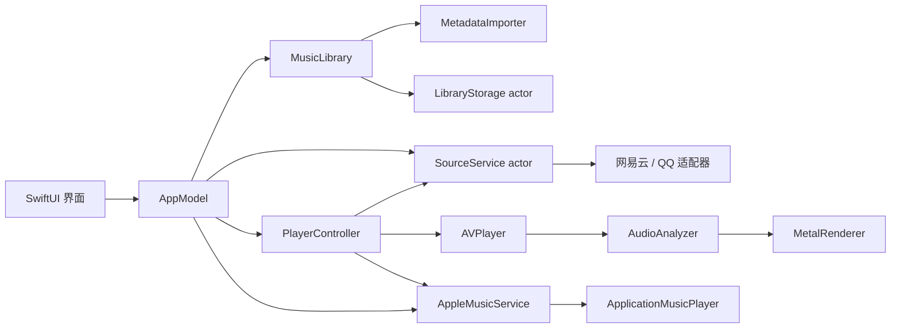

# AlpacaMusic 原生架构与音源接入

本文对应当前 Swift 工程，说明已经实现的运行路径、接口契约和验证边界。

## 平台与构建

工程使用 Swift 6 语言模式，`Package.swift` 要求 Swift tools 6.4，最低系统为 macOS 26.0；`Info.plist` 的 `LSMinimumSystemVersion` 同样为 26.0。本次开发环境使用 macOS 27 SDK。执行文件与测试目标均启用 `-warnings-as-errors`。

界面由 SwiftUI 构建，通过 Observation 驱动状态；窗口、菜单、文件导入和设置页面使用系统 API。点云画面由 `NSViewRepresentable` 包装 `MTKView`，通过 Metal 绘制，不需要网页运行时。

音频标签使用 `AVURLAsset` 的异步加载接口，包括 `load(.isPlayable, .duration, .commonMetadata)`、`loadTracks(withMediaType:)` 和元数据项的 `load(.stringValue)` / `load(.dataValue)`。支持类型查询使用 macOS 26 起提供的 `audiovisualContentTypes`，没有采用在 macOS 27 弃用的 `audiovisualTypes()`。这些选择与 [Apple 的异步媒体加载说明](https://developer.apple.com/documentation/avfoundation/loading-media-data-asynchronously)及[支持类型接口](https://developer.apple.com/documentation/avfoundation/avurlasset/audiovisualcontenttypes)一致。

音频分析在 macOS 27 使用未指定单独音轨的 `AVMutableAudioMixInputParameters()` 接收混合输出，并调用 `MTAudioProcessingTapCreateWithPreferredFormat`；macOS 26 通过可用性分支使用指定音轨的参数与该系统支持的 tap 创建接口，HLS 无可分析音轨时继续播放但不提供频谱。SDK 27 的警告检查能发现当前 SDK 标注的弃用，不能保证 Apple 未来不会调整这些 API；最低部署版本也不等于已经在独立 macOS 26 设备上完成运行验收。

```sh
swift build
swift test
./scripts/build-app.sh
```

打包脚本默认构建 release，输出 `build/AlpacaMusic.app`。可通过 `CONFIGURATION=debug` 选择调试构建。

## 状态与播放数据流



| 模块 | 当前职责 |
| --- | --- |
| `AppModel.swift` | 页面、搜索、导入入口、提示、视觉设置；合并本地筛选与远端搜索结果 |
| `MusicLibrary.swift` | 曲目、收藏、歌单、音源配置；协调启动加载与持久化 |
| `MetadataImporter.swift` | 文件及文件夹扫描、音频可播检查、标签、缩略图、安全书签 |
| `SourceService.swift` | 配置校验、并发搜索、播放地址解析、接口错误转换 |
| `PlayerController.swift` | 单首播放、混合来源队列、上一首/下一首、插队、随机与循环、进度、音量、系统媒体命令 |
| `AudioAnalyzer.swift` | 从播放音频取样，计算能量、频谱和节拍；无法分析时保持播放路径可用 |
| `PointCloudView.swift` / `MetalRenderer.swift` | 封面点云、音频响应、拖动旋转、归位、过渡、画质调节 |

“多音源”表示不同来源的歌曲可以进入同一队列，顺序播放；当前没有多首歌曲同时混音的功能。本地、直链、网易云与 QQ 使用 `AVPlayer`；Apple Music 使用 `ApplicationMusicPlayer`。`PlayerController` 根据来源切换引擎，切换前停止旧引擎，并用取消及代次检查隔离晚到请求。

Apple Music 的授权、订阅检查、目录请求与播放由 `AppleMusicService` 管理。开发者构建配置和真实签名团队通过检查后，仍需要用户主动授权；配置标志不是 Apple 服务已连通的证明。搜索结果可以保存在 AlpacaMusic 自己的收藏与歌单中，此操作不修改用户云端 Apple Music 歌单。Apple Music 不进入 PCM 分析链，展示原始封面并提示使用系统音量。Spotify 当前仅提供官方页面链接。参见[官方平台接入范围](official-platforms.md)与[开发者配置](apple-music-setup.md)。

播放请求用代次标识与任务取消防止旧请求在切歌或停止后重新激活。队列、进度、音量等写入 `UserDefaults`；重启恢复为暂停或空闲状态，不自动开始播放。视觉设置和自定义预设也由 `UserDefaults` 保存。点云遵循应用及系统的减少动态效果设置；启用节能选项且系统处于低电量模式时，将目标帧率降至 30 FPS，其他情况下目标为 60 FPS。目标帧率不是所有设备上的性能保证。

## 本地音乐、书签与资料库

SwiftUI `fileImporter` 允许选择多个音频文件或文件夹。文件夹扫描跳过隐藏内容、文件包和嵌套符号链接，并限制目录深度及单次导入数量。单次最多导入 5000 首；资料库最多保存 10000 条曲目记录。

导入器运行在独立 actor 上。选中文件的安全作用域覆盖扫描、异步读取及书签创建全过程；成功获取的作用域都会配对释放。每首本地曲目保存只读安全书签：

- 创建：`[.withSecurityScope, .securityScopeAllowOnlyReadAccess]`。
- 恢复：`[.withSecurityScope, .withoutUI]`；启动时更新失效但仍能解析的书签。
- 播放：播放器持有访问作用域，释放当前播放项时结束访问。
- 文件无法解析或读取时保留记录并标记不可用，供用户重新导入，不自动删除收藏。

这是 [Apple 安全作用域资源访问](https://developer.apple.com/documentation/foundation/url/startaccessingsecurityscopedresource())要求的生命周期配对。文件路径仍作为曲目元数据存在，沙盒授权依赖书签，不能用路径代替授权。

封面通过 ImageIO 生成最长边 384 像素的 PNG 缩略图，限制原始封面及缩略图体积。没有封面或封面无法处理时使用界面的备用图形。后缀仅决定扫描候选；最终依据 AVFoundation 的可播放状态及音轨检查。系统无法解码的容器或编码会报告错误，不能因为后缀包含 OGG、Opus 或其他格式就保证可播。

默认资料库位置为 `URL.applicationSupportDirectory/AlpacaMusic/library-v1.json`。开发包通常对应 `~/Library/Application Support/AlpacaMusic/`；沙盒包由系统定位到应用容器。`ALPACA_DATA_DIR` 可为开发和测试指定独立资料库目录，但不会同步隔离 `UserDefaults`。

持久化采用 Codable JSON，包含曲目、书签、封面缩略图、收藏、歌单和音源配置。`LibraryStorage` actor 串行处理磁盘操作，并用递增修订号拒绝晚到的旧快照；写入使用 `Data.write(options: .atomic)`。启动期间用户的添加、导入、收藏、删除和配置修改会按顺序记录，在已有资料库或首次试听数据加载后重新应用，避免初始化结果覆盖刚做的操作。

无资料库文件时才生成三段原创试听；用户删除试听后，后续启动不会重新添加。JSON 或结构校验失败时，先保留为 `library-v1.corrupt-<UUID>.json`，再创建空资料库并显示提示；原件无法读取时阻止写入，避免用部分状态覆盖原文件。这是本地损坏恢复机制，不是历史版本备份系统。

删除歌曲只移除资料库记录、收藏和歌单引用，UI 同时处理队列移除，原始音频不会被移动或删除。正常退出通过 `applicationShouldTerminate` 延后结束，等待资料库写入，再关闭播放器；进程被强制终止时不能承诺保存尚未执行的操作。

## 网易云与 QQ 配置

默认入口现为应用内网页登录：`DirectLoginView` 使用临时 WebKit 数据存储显示平台官网及其登录弹窗。用户在平台页面输入或扫码，点击连接后仅提取音乐会话需要的 Cookie；`NativeMusicClient` 使用平台身份接口验证，成功后保存至本机应用专用钥匙串。登录窗口关闭时清理临时网页数据，不读取其他浏览器会话。

`NeteaseDirectProvider` 实现网页 weapi 请求；`QQDirectProvider` 实现 QQ 网页请求及 zzc 签名。两者通过 `NativeMusicHTTP` 的固定 HTTPS 主机列表访问平台，无兼容服务器或 Node 运行时。请求不使用全局 Cookie/凭证存储，重定向不允许带会话离开原主机；已连接平台不会因请求失败而退回自定义服务器。平台算法与当前验证证据分别见 [网易云](netease-direct.md)、[QQ](qq-direct.md)。

`ConnectedMusicAccounts` 管理可见状态。登录尝试使用独立 UUID；取消、退出及账号切换使晚到请求失效。凭证写入和清理按平台串行执行，取消能回滚尚未完成展示的连接，旧窗口取消不能撤销新账号。导入曲库仅保存资料，不保存 Cookie。

`RemotePlaylistsView` 读取平台歌单，用户选择后加载完整曲目，再交给 `MusicLibrary.importRemotePlaylist` 一次性合并。平台、账户、歌单 ID 组成稳定的本地标识；重复导入补充新增曲目，保留本地编辑，不向云端写入，也不是持续双向同步。曲库最多 10000 首，超限时整体拒绝此次导入，不报告部分成功。

### 高级自定义服务

未登录、也未启用高级服务的音源不参与搜索。已有服务配置继续保留在“高级：自定义服务”下；账号直连优先，登录凭证不会发送给该服务。以下旧兼容路由仅用于这一高级选项，普通用户无需配置。

在侧栏进入“音源”，选择“配置音源”，填写自己的兼容服务根地址并启用，保存后可点击连接测试。示例仅用于说明地址格式：

- 网易云：`http://127.0.0.1:3000`
- QQ：`http://127.0.0.1:3300`

服务部署在其他设备或 HTTPS 域名时，改为实际可达地址。允许保留服务的路径前缀，例如 `https://music.example/api`；不要把 `/cloudsearch` 或 `/search` 本身填成根地址。地址必须为 HTTP 或 HTTPS，不能包含账号密码、查询参数或锚点；`file:` 等协议会被拒绝。

当前请求契约如下，均为 GET，请求参数由 `URLComponents` 编码。

| 音源 | 操作 | 相对于服务根地址的路径与参数 | 主要响应字段 |
| --- | --- | --- | --- |
| 网易云 | 搜索 | `/cloudsearch?keywords=<关键词>&type=1&limit=50` | `result.songs`；歌曲 `id`、`name`、`ar`/`artists`、`al`/`album`、`dt`/`duration`，时长毫秒转秒 |
| 网易云 | 播放地址 | `/song/url/v1?id=<歌曲ID>&level=standard` | `data` 中 ID 匹配项的 `url`；检查单曲 `code` 和 `freeTrialInfo` |
| 网易云 | 旧路由兼容 | 仅前一路由返回 404/405 时请求 `/song/url?id=<歌曲ID>&br=128000` | 同上；权限不足、空地址及试听片段不会触发该兼容重试 |
| QQ | 搜索 | `/search?key=<关键词>&pageNo=1&pageSize=50&t=0` | `data.list`，兼容 `data.songlist`、`data.song.list`、顶层 `songlist`；使用 `songmid`/`mid` |
| QQ | 播放地址 | `/song/urls?id=<songmid>` | `data[<songmid>]` 的直接音频 URL |

QQ 契约依据 [jsososo/QQMusicApi 上游文档](https://raw.githubusercontent.com/jsososo/QQMusicApi/master/docs/README.md)。网易云适配器实现上述兼容路由；[原 Binaryify 项目](https://github.com/Binaryify/NeteaseCloudMusicApi)已经归档，不能据此保证任意现有分支的兼容性。更换服务实现后应重新测试其实际响应。

`SourceService` 使用 `URLSessionConfiguration.ephemeral`，禁用 Cookie、凭据及响应缓存存储。请求等待超时设为 10 秒，资源请求上限设为 15 秒，接口响应最多读取 4 MiB。多个启用音源通过任务组并发搜索；一个服务失败时，其错误随该音源结果返回，不丢弃其他音源的成功结果。当前搜索每个源最多请求 50 首，没有分页加载界面。

连接测试实际执行关键词 `music` 的搜索，只能说明搜索路由及响应格式可用。歌曲权限在点播解析时另行检查：登录过期、无播放权限、订阅或购买要求、下架、地区限制、空地址、试听片段和接口不兼容都会转成错误提示。网络音源会在点播时重新解析地址，不把一次取得的临时音频 URL 当成永久授权。

## 网络与功能边界

账号登录由用户的服务管理。客户端没有扫码登录、密码表单、自动取得 Cookie、会员解锁、跨服务寻找替代版权音频或远端歌曲下载功能。应用会为在线播放传输音频数据，也会在本地生成自有试听文件；这不构成离线下载管理器。

音频直链及 HLS 交由 AVPlayer 播放，是否可播还取决于实际媒体格式、网络、TLS、访问权限及系统支持。优先配置 HTTPS；HTTP 连接没有传输加密。为支持用户显式指定的 HTTP 服务与音频地址，当前 `Info.plist` 设置 `NSAllowsArbitraryLoads=true`，没有同时设置会覆盖该行为的 `NSAllowsLocalNetworking`；仍保留局域网用途说明。客户端没有跳过 HTTPS 证书验证。ATS 例外不代表地址必然可达，保存成功与连接成功仍需区分；例外项的交互见 [Apple ATS 规则](https://developer.apple.com/documentation/bundleresources/information-property-list/nsapptransportsecurity/nsallowslocalnetworking)。

## 开发包与可选沙盒包

默认运行 `./scripts/build-app.sh` 会生成本机 ad-hoc 签名的开发包，不启用 App Sandbox。代码仍使用文件选择器和安全书签，但默认包没有操作系统沙盒对全部文件访问的强制边界。

```sh
SANDBOX=1 ./scripts/build-app.sh
```

可选沙盒包使用 `AlpacaMusic.entitlements`，开启 App Sandbox，并申请出站网络、用户选择文件只读访问及应用级安全书签权限。实际文件访问仍取决于系统文件选择授权与持久书签。沙盒包与开发包的数据位置可能不同，当前没有两者之间的自动资料库迁移。

两种构建都会执行 `codesign --verify --strict`；这项检查验证签名结构，不等于 Developer ID 分发签名、公证、App Store 审核或沙盒导入流程的端到端验证。脚本当前没有分发证书与公证步骤。

## 验证范围

源适配器通过可注入 HTTP transport 测试响应格式、参数、禁用配置、独立失败、超时错误、体积限制、缺少权限、试听限制及旧路由兼容。曲库测试使用临时目录与真实 WAV，覆盖标签与书签读取、恢复、原文件保留、损坏备份、扫描规则、快速连续写入和启动期间操作合并。这些测试不访问用户的真实音乐库。

```sh
swift test --filter 'SourceTests|LibraryTests'
```

开发阶段此源/库定向测试已通过。其他测试文件覆盖队列、实际本地及受控 HTTP 音频播放、频谱、视觉设置与 Metal；完整结果应以同一份源码运行 `swift test` 的日志为准，不能用定向测试代替全部运行验收。

目前用户尚未提供网易云或 QQ 服务地址。没有验证实际部署的登录状态、订阅权限、真实曲目搜索、CDN 可达性或平台长期可用性。兼容协议测试通过并不表示这些平台已连接；拿到服务后，仍需依次完成连接测试、真实歌曲搜索、可授权曲目点播、切歌与错误反馈检查。
